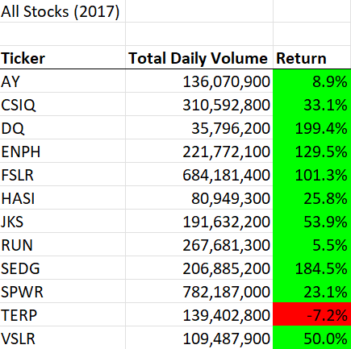
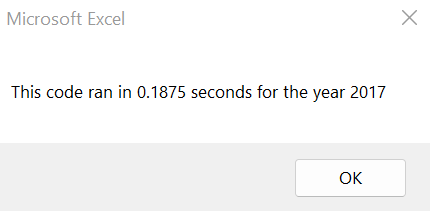

# Stock Analysis Using VBA Excel

## Overview of Project

PUT TEXT HERE

### Purpose

PUT TEXT HERE

## Analysis

### 2017 Stock Analysis

<b>Figure 1.1</b>

<b>Figure 1.2</b>

PUT TEXT HERE

### 2018 Stock Analysis

<b>Figure 2.1</b>

<b>Figure 2.2</b>

PUT TEXT HERE

## Summary

PUT TEXT HERE

### Refactored Code

PUT CODE HERE

### Advantages & Disadvantages of Refactoring Code

* Advantages:

PUT TEXT HERE

* Disadvantages:

PUT TEXT HERE

